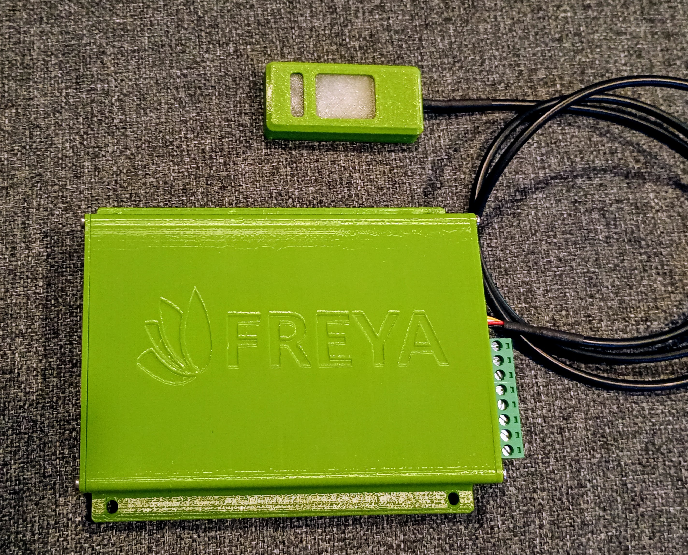

The **Freya Vivarium Control System** consists of the [Edgeberry Base Board](https://github.com/Edgeberry/Edgeberry-hardware) with the [Edgeberry Sense'n'Drive Cartridge](https://github.com/Edgeberry/Edgeberry_SenseAndDrive_Cartridge) and the [Freya Sensor (Rev.1)](https://github.com/Freya-Vivariums/Sensor-hardware).

Through the sensor, environment variables from within the vivarium are measured:
- Temperature
- Humidity
- Air pressure
- (Air quality)
- Daylight intensity
- UVA/B/C

The control system has 6 sourcing digital outputs for interfacing with several types of actuators.


<br clear="right"/>


## Installation
The Freya Core installer will prompt you to select the hardware interface, so manual installation is not required. Should you prefer to install this component manually, follow these steps:
```
wget -O install.sh https://github.com/Freya-Vivariums/Freya-hardware/releases/latest/download/install.sh;
chmod +x ./install.sh;
sudo ./install.sh;
```

The software is installed as a `systemd` service, which is automatically started.
```
# systemctl status io.freya.HardwareInterface.service
```

To view the log files of the service, run:
```
# journalctl -u io.freya.HardwareInterface.service -f
```

### Actuators
The actuators are controlled by the [Edgeberry Sense'n'Drive Cartridge](https://github.com/Edgeberry/Edgeberry_SenseAndDrive_Cartridge)s digital outputs.

| Digital out | RPi GPIO | Actuator           |
|-------------|----------|--------------------|
| D1          | GPIO21   | Main lighting      |
| D2          | GPIO20   | Heater element     |
| D3          | GPIO16   | Misting pump       |
| D4          | GPIO13   | NC                 |
| D5          | GPIO12   | Ventilation        |
| D6          | GPIO18   | Secondary lighting |

### Sensors
Detect sensors on the I2C bus
```
i2cdetect -y 1
```


## License & Collaboration
**Copyright© 2024 Sanne 'SpuQ' Santens**. This project is released under the [**GNU GPLv3**](https://www.gnu.org/licenses/gpl-3.0.en.html) license. However, [trademark rules](https://github.com/Freya-Vivariums/.github/blob/main/brand/Freya_Trademark_Rules_and_Guidelines.md) apply to the Freya™ brand.

### Collaboration

If you'd like to contribute to this project, please follow these guidelines:
1. Fork the repository and create your branch from `main`.
2. Make your changes and ensure they adhere to the project's coding style and conventions.
3. Test your changes thoroughly.
4. Ensure your commits are descriptive and well-documented.
5. Open a pull request, describing the changes you've made and the problem or feature they address.